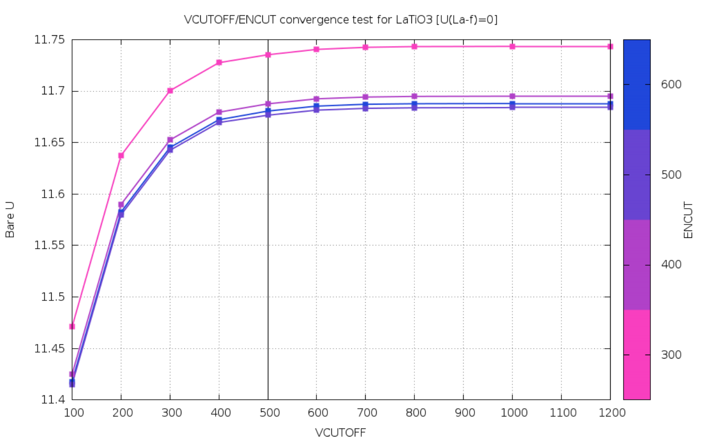

# How to do cRPA calculations with VASP

This is just a small tutorial and help on how to do cRPA calculations within
VASP (https://cms.mpi.univie.ac.at/wiki/index.php/CRPA_of_SrVO3) . Moreover, the
python script `eval_U.py` contains helper functions to extract the full
$U$ matrix tensor from the `Uijkl` or `Vijkl` file from a VASP cRPA run. There
are also some general remarks on the notation in VASP for the Coulomb tensor in
the pdf included in this folder. Moreover, there is a small collection of
examples for SrVO3 and LuNiO3. For more details please take a look at the PhD
thesis of Merzuk Kaltak (http://othes.univie.ac.at/38099/).

## file description
 * `eval_U.py` extraction of Coulomb tensor, calculation of reduced two-index matrices, and calculation of Kanamori or Slater parameters
 * `ext_eps.sh` a small bash script that can extract $\epsilon^-1(|q+G|)=[1-VP^r]^-1$ from a given vasprun.xml file
 * `notations_of_Uijkl in VASP.pdf` general remarks on the notation of the Coulomb tensor in VASP

## Workflow:
1. DFT NM normal like:
    * SYSTEM = SrVO3
    * ISMEAR =  0
    * SIGMA =  0.05
    * EDIFF = 1E-8
2. optical part (larger nbands) and optical properties for generating the linear response integrals needed for cRPA or GW
    1. nbands: ~100 bands per atoms, but not larger than number of plane waves generated from ENCUT
    2. example:
        * SYSTEM = SrVO3
        * ISMEAR =  0
        * ENCUT = high value!
        * SIGMA =  0.05
        * EDIFF = 1E-8
        * ALGO = Exact ; NELM=1
        * LOPTICS = .TRUE.
        * LWAVE = .TRUE.
        * NBANDS =96
        * LMAXMIX=4
3. if needed generate wannier functions with ALGO=none (read wavecar and chgcar additionally) and do 0 steps to get the wannier functions correct - this step is not needed, if one has already a wannier90.win file
4. ALGO=CRPA to make vasp calculate U matrices (bare, screened etc. )
    1. omegamax=0 (default) for frequency depend U matrix
    2. NCRPALOW,NCRPAHIGH for selecting bands in a non-disentagled workflow
    3. or set NTARGET= # of target states for using the KUBO formalism for disentanglement. Works directly with the wannier functions as basis
    4. example file:
        * SYSTEM = SrVO3
        * ISMEAR =  0
        * ENCUT = high value!
        * VCUTOFF = reasonable high value!
        * SIGMA =  0.05
        * EDIFF = 1E-8
        * NBANDS =96
        * ALGO = CRPA
        * NCRPAHIGH= 23
        * NCRPALOW= 21 #for selecting bands
        * or NTARGET_STATES = 3*1
        * LWAVE = .FALSE.
        * NCSHMEM=1
        * LMAXMIX=4

## important flags:
if you get sigsevs while calculationg the polarization make sure your local stack
size is large enough by setting:
```
ulimit -s unlimited
```

* ALGO=CRPA (automatically calls wannier90 and calcs the U matrix)
* NTARGET_STATES= # number of target wannier funcitons if more target states than basis functions for U matrix one specifiy it like 3*1 2*0 . This would build the U matrix for the first 3 wannier functions in wannier90.win, where 5 wannier functions are specified there in total and not for the last 2 (2*0).
* NCRPALOW / NCRPAHIGH for selecting bands and using the standard CRPA formalism
* LOPTICS= TRUE for calculating the necessary response integrals withing the Kohn-Sham Basis W000x.tmp
* NCSHMEM=1 nodody knows, but it is needed!
* VCUTOFF cuttoff for bare interaction V. This tests your convergency
and is written in the OUTCAR as two sets of bare interaction, where for one of them
it says: low cutoff result for V_ijkl. Here ENCUT was used and for the one above 1.1*ENCUT or VCUTOFF was used.
* usually a converged ENCUT gives also a reasonably high VCUTOFF, so that explicitly setting VCUTOFF is not necessary. Moreover, the effect of the VCUTOFF convergence is included by subtracting the constant shift between LOW and HIGH VCUTOFF test output in the OUTCAR
* One can see in the convergence plot "examples/LaTiO3/VCUTOFF_convergence.png" the effect of ENCUT and VCUTOFF:



## convergency tests:
$`E_{corr}^{RPA}`$  converges for NBANDS,ENCUT to $`\infty`$, where the asymptotic
behavior goes like $`1/N_{bands} \approx ENCUT^{-3/2} `$. The ENCUT for the GW part
is set automatically by VASP with the ratio: $`ENCUTGW = 2/3 \ ENCUT`$. Moreover,
it is crucial to first converge the bare interaction V that does not depend on the
polarization. To do these tests set in the INCAR file:
* ALGO = 2E4W  # calculates only the V
* LWPOT = .FALSE # avoid errors
* VCUTOFF # vary the cut-off until convergency is reached, default is 1.1*ENCUT
* NBANDS # minor effect on V then on W, but nevertheless a reasonable amount of
bands must be used. A good choice is 3*NELECT (# of electrons in the systems).

The procedure is then to first convergence KPOINTS and ENCUT, where KPOINTS dependency of the results seems to be weak. Then increase NBANDS until U does not change anymore.

## general sidemarks:
* careful with the averaged U,u,J values, because they sum all off-diagonal elements! Also inter-site, if the unit cell contains more than one target atom
* when specifying bands, always start with 1 not 0.
* GW pseudopotentials can be more accurate, since they provide higher cut-offs e.g. , test this...
* NCRPALOW/HIGH and NTARGET_STATES gives the same result in non-entangled bands

## version and compilation:
* supported vasp version 5.4.3 developer version
* the flag  -Dvasp6 must be set!!!! -> will be a feature of vasp 6+
* safer to use wannier90 1.2 than 2.x !
